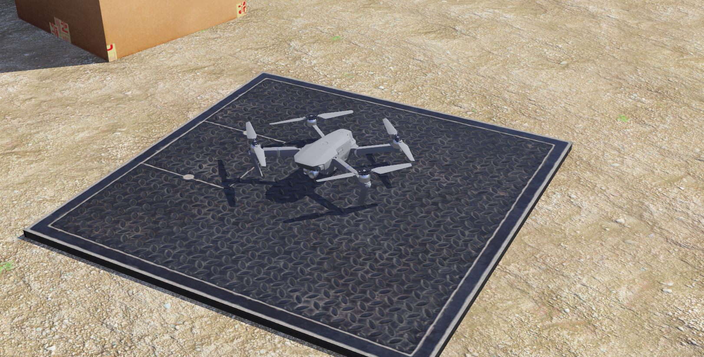
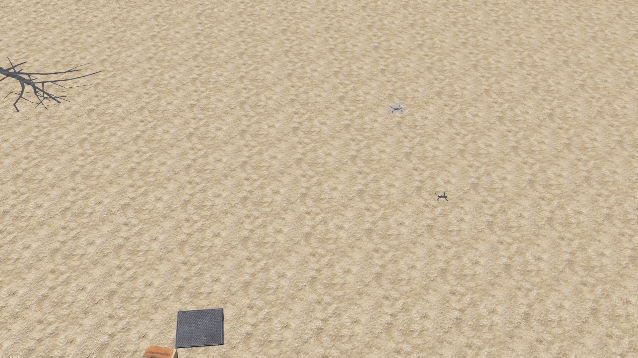

# AIMS Drone Control
This repository contains drone control code. Webots is used as the simulation. The code for real-world experiments via PX4 is also provided. This repo containts a LQR controller and a NMPC controller.

For trajectory tracking, NMPC is used. Otherwise, LQR is used. Note: for the current version, NMPC is always used. But LQR is implemented already.

This is mainly developed by [Zhipeng Shen](https://shenzp97.github.io/ZhipengSHEN/).

# Acknowledgements
The LQR controller is based on [CMU Optimal Control Lecture 15 ](https://youtu.be/AxmE2uTPglg?si=Tl6ZeRqFqFjlo2Ys).

The NMPC controller is based on [acados](https://docs.acados.org/). We refered to [Data-driven mpc](https://github.com/uzh-rpg/data_driven_mpc).

# Installation
The code was tested with Ubuntu 20.04, Python 3.10 and ROS noetic.


## ROS and Mavros
Install ROS Noetic by following [this](http://wiki.ros.org/noetic/Installation/Ubuntu) or refering to:

```bash
sudo sh -c 'echo "deb http://packages.ros.org/ros/ubuntu $(lsb_release -sc) main" > /etc/apt/sources.list.d/ros-latest.list'
sudo apt-key adv --keyserver 'hkp://keyserver.ubuntu.com:80' --recv-key C1CF6E31E6BADE8868B172B4F42ED6FBAB17C654
sudo apt update
sudo apt install ros-noetic-desktop-full
echo "source /opt/ros/noetic/setup.bash" >> ~/.bashrc

# Install vrpn client (for Vicon):
sudo apt-get install ros-noetic-vrpn-client-ros 
```

Install Mavros:
```bash
# use noetic to replace ${ROS_DISTRO}
sudo apt-get install ros-${ROS_DISTRO}-mavros ros-${ROS_DISTRO}-mavros-extras ros-${ROS_DISTRO}-mavros-msgs
cd /opt/ros/noetic/lib/mavros
sudo ./install_geographiclib_datasets.sh
```

## Python env
**Recommended**: Create a Python virtual environment for this package:
The default Python env for Ubuntu20.04 is Python 3.8. We recommend to use Python 3.10. To install Python 3.10 on Ubuntu20.04:
```bash
sudo apt update
sudo apt install software-properties-common -y

# Add custom APT repository
sudo add-apt-repository ppa:deadsnakes/ppa # Press ENTER to confirm adding repository.
sudo apt update
sudo apt install python3.10 python3.10-venv python3.10-dev
# Now, create the Python env:
sudo pip3 install virtualenv

# create virtual env:
cd <PATH_TO_VENV_DIRECTORY>
virtualenv aims_control_env --python=/usr/bin/python3.10
source aims_control_env/bin/activate
```

Also install [acados](https://docs.acados.org/installation/index.html) and it's [Python interfaces](https://docs.acados.org/interfaces/index.html#installation).

```bash
cd <CATKIN_WS_DIR>
source <PATH_TO_VENV_DIRECTORY>/aims_control_env/bin/activate
git clone https://github.com/ShenZp97/aims_drone_control.git

cd aims_drone_control
sudo apt-get install ros-noetic-tf2-sensor-msgs
pip install -r requirements.txt

```


## Webots

<p align="center">
    

</p>

Install Webots by following [this link](https://cyberbotics.com/doc/guide/installing-webots) (tested with Webots R2023b).
If you are new to Webots, please find the tutorials [here](https://cyberbotics.com/doc/guide/tutorials).
Now, open a terminal:
```bash
# Source the Python env:
source <PATH_TO_VENV_DIRECTORY>/aims_control_env/bin/activate

# Source package:
cd <CATKIN_WS_DIR>/aims_drone_control
catkin_make
source devel/setup.bash
```
If missing python-empy when catkin_make, use `pip install empy==3.3.4`.

Remember to change ROS_MASTER_URI in *<CATKIN_WS_DIR>/aims_drone_control/controllers/Mavic_ros1_driver/runtime.ini*
```bash
# Open Webots:
webots
```

**Note**: You should open webots in a terminal where the Python env and the package are sourced. If not, you may find the python telling you that you are missing modules such as aims_msgs or rospy.

**Note**: If you cannot download assets when starting Webots, see [this link](https://www.cyberbotics.com/doc/guide/installation-procedure?version=master#asset-cache-download) to download assets.

The world files are in the worlds folder of this repo. Open Webots, and open the world *mavic_world.wbt* (in *<CATKIN_WS_DIR>/aims_drone_control/worlds*).

Now, we can interact with Webots using ROS.
Open 2 terminals, in one terminal enter:
`roscore`

In the other terminal, 
```bash
# Source the Python env:
source <PATH_TO_VENV_DIRECTORY>/aims_control_env/bin/activate

# Source package:
cd <CATKIN_WS_DIR>/aims_drone_control
source devel/setup.bash
```

Now, let's have fun!
the following commands are available:

Takeoff:

`rostopic pub -1 /drone_command std_msgs/String "{data: 'takeoff'}"`

<p align="center">
    

</p>

Give point:

`rostopic pub -1 /goto_position geometry_msgs/PoseStamped "{pose:{position:{x: 5.0, y: 5.0, z: 2.0}, orientation:{w: 1.0, x: 0.0, y: 0.0, z: 0.0}}}"
`

Go to this point:

`rostopic pub -1 /drone_command std_msgs/String "{data: 'gotopoint'}"
`

<p align="center">
    

</p>

Land:

`rostopic pub -1 /drone_command std_msgs/String "{data: 'land'}"
`

<p align="center">
    

</p>

**Note**: if you want to hover at "{pose:{position:{x: 1.0, y: 1.0, z: 1.0}, orientation:{w: 0.0, x: 0.0, y: 0.0, z: 1.0}}}" using LQR, you may need to recompute the LQR gains.

Load trajectory, simply run `rosrun load_traj load_agile_traj.py`. 
**Please check the trajectory before you run real experiments! Do NOT directly run this trajectory in real-world experiments!** This trajectory is just a example.

<p align="center">
    

</p>

<p align="center">
    

</p>

The initial state is up-side-down:
<p align="center">
    

</p>


## Real-world experiment with PX4
**Note!!!:** Real-world experiments can be dangerous. You should understand how the code works. Please make sure you know what you are doing.

Start Mavros and Vicon (you may need to change accordingly, e.g., the fcu_url of mavros, the ip address in vicon launch file, etc.):
```
roslaunch mavros px4.launch fcu_url:=udp://:14560@192.168.50.82:14560
roslaunch vrpn_client_ros aims3_vicon.launch
```
This code will aotumatically pass the odometry to PX4. This allows you to swtich to position mode during the experiment, if there is any emergency. Just make sure sticks of the remote controller is in middle positioni.
For PX4 with external position estimation, please revise the settings according to [PX4 documentation]( https://docs.px4.io/main/en/ros/external_position_estimation.html).

Run the controller node:
```bash
# Source the Python env:
source <PATH_TO_VENV_DIRECTORY>/aims_control_env/bin/activate

# Source package:
cd <CATKIN_WS_DIR>/aims_drone_control
source devel/setup.bash

roslaunch aims_px4_control manta36_exp.launch
```

The commands for takeoff, land, ..., are as same as the Webots part.
